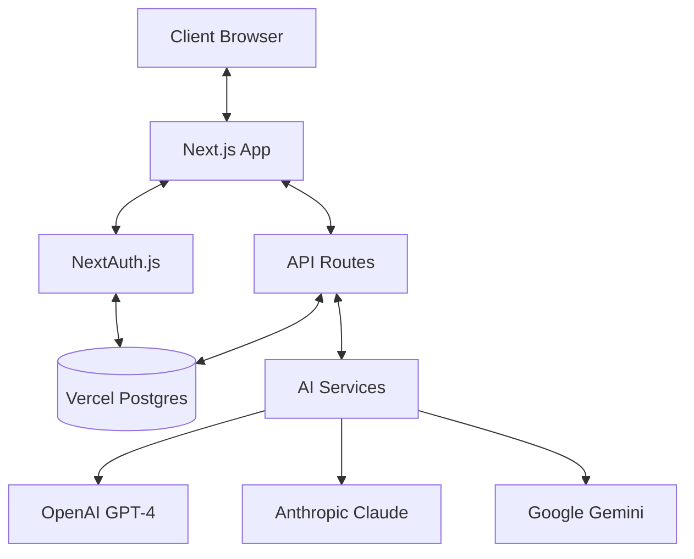

# Design Document

## Overview

SEO記事生成・管理システムは、GitHub でソース管理され、Vercel でホスティングされるモダンなWebアプリケーションとして設計されます。Next.js（React）、TypeScript、Prisma ORM、PostgreSQL（Vercel Postgres）を使用し、複数のAI APIと連携してSEO最適化記事を大量生成・管理する機能を提供します。

システムは会員制で運営され、ユーザーごとに複数サイトの管理、多言語記事生成、トークン使用量管理を行います。

## Architecture

### System Architecture



### Application Layers

1. **Frontend Layer**: Next.js (React) + TypeScript
2. **API Layer**: Next.js API Routes
3. **Data Access Layer**: Prisma ORM + PostgreSQL
4. **Integration Layer**: AI API連携サービス

### Technology Stack

- **Version Control**: GitHub
- **Hosting/Deployment**: Vercel
- **Frontend Framework**: Next.js 14 (React)
- **Language**: TypeScript
- **Database**: PostgreSQL (Vercel Postgres)
- **ORM**: Prisma
- **Authentication**: NextAuth.js
- **AI APIs**: OpenAI GPT-4, Anthropic Claude, Google Gemini
- **Styling**: Tailwind CSS
- **State Management**: React Context API / Zustand
- **Email Service**: SendGrid / Resend.com

## Components and Interfaces

### Core Components

#### 1. User Management Component
- **Purpose**: 会員制認証とユーザー管理
- **Key Files**:
  - `app/api/auth/[...nextauth]/route.ts`: 認証API
  - `lib/auth.ts`: 認証ヘルパー関数
  - `components/auth/`: ログイン/登録コンポーネント
  - `prisma/schema.prisma`: ユーザーモデル定義

#### 2. Site Management Component
- **Purpose**: 複数サイトの管理とURL解析
- **Key Files**:
  - `app/api/sites/route.ts`: サイトAPI
  - `app/sites/page.tsx`: サイト管理ページ
  - `lib/site-crawler.ts`: URL自動取得処理
  - `components/sites/`: サイト関連コンポーネント

#### 3. AI Integration Component
- **Purpose**: 複数AI APIとの連携
- **Key Files**:
  - `lib/ai/ai-service.ts`: AIサービスインターフェース
  - `lib/ai/openai-service.ts`: OpenAI API連携
  - `lib/ai/claude-service.ts`: Claude API連携
  - `lib/ai/gemini-service.ts`: Gemini API連携
  - `lib/ai/token-manager.ts`: トークン使用量管理

#### 4. Content Generation Component
- **Purpose**: 記事方針・概要・本文生成
- **Key Files**:
  - `lib/content/policy-generator.ts`: 記事作成方針生成
  - `lib/content/outline-generator.ts`: 記事概要生成
  - `lib/content/article-generator.ts`: 記事本文生成
  - `lib/content/language-processor.ts`: 多言語処理

#### 5. Article Management Component
- **Purpose**: 記事データの管理と操作
- **Key Files**:
  - `app/api/articles/route.ts`: 記事API
  - `app/articles/page.tsx`: 記事一覧ページ
  - `lib/export/csv-exporter.ts`: CSV出力機能
  - `lib/batch/batch-processor.ts`: 一括処理機能

#### 6. Notification Component
- **Purpose**: 自動メール送信機能
- **Key Files**:
  - `lib/email/email-service.ts`: メール送信処理
  - `lib/content/daily-proposal.ts`: 日次記事提案生成
  - `app/api/cron/daily-proposals/route.ts`: 定期実行API

### API Interfaces

#### AI Service Interface
```typescript
interface AIService {
  generateContentPolicy(siteInfo: SiteInfo): Promise<string>;
  generateArticleOutlines(policy: string, count: number): Promise<ArticleOutline[]>;
  generateArticleContent(outline: ArticleOutline, language: string): Promise<string>;
  getTokenUsage(): Promise<number>;
}
```

#### Data Access Interface
```typescript
interface Repository<T> {
  create(data: Omit<T, 'id'>): Promise<T>;
  findById(id: string): Promise<T | null>;
  findMany(filter?: any): Promise<T[]>;
  update(id: string, data: Partial<T>): Promise<T>;
  delete(id: string): Promise<boolean>;
}
```

## Data Models

### Prisma Schema

```prisma
// prisma/schema.prisma

generator client {
  provider = "prisma-client-js"
}

datasource db {
  provider = "postgresql"
  url      = env("DATABASE_URL")
}

model User {
  id                String         @id @default(cuid())
  email             String         @unique
  password          String?        // ハッシュ化されたパスワード（ソーシャルログイン時はnull）
  name              String?
  image             String?
  createdAt         DateTime       @default(now())
  updatedAt         DateTime       @updatedAt
  sites             Site[]
  tokenUsage        TokenUsage[]
  settings          UserSettings?
}

model UserSettings {
  id                String         @id @default(cuid())
  userId            String         @unique
  user              User           @relation(fields: [userId], references: [id], onDelete: Cascade)
  aiService         String         @default("gpt-4")
  tokenLimitMonthly Int            @default(100000)
  emailNotifications Boolean       @default(true)
  createdAt         DateTime       @default(now())
  updatedAt         DateTime       @updatedAt
}

model Site {
  id                String         @id @default(cuid())
  userId            String
  user              User           @relation(fields: [userId], references: [id], onDelete: Cascade)
  name              String
  url               String?
  siteImage         String?        @db.Text
  contentPolicy     String?        @db.Text
  createdAt         DateTime       @default(now())
  updatedAt         DateTime       @updatedAt
  siteUrls          SiteUrl[]
  articleOutlines   ArticleOutline[]
}

model SiteUrl {
  id                String         @id @default(cuid())
  siteId            String
  site              Site           @relation(fields: [siteId], references: [id], onDelete: Cascade)
  url               String
  isActive          Boolean        @default(true)
  createdAt         DateTime       @default(now())
}

model ArticleOutline {
  id                String         @id @default(cuid())
  siteId            String
  site              Site           @relation(fields: [siteId], references: [id], onDelete: Cascade)
  title             String
  outline           String         @db.Text
  seoKeywords       String?        @db.Text
  userRating        Int?
  createdAt         DateTime       @default(now())
  articles          Article[]
}

model Article {
  id                String         @id @default(cuid())
  outlineId         String
  outline           ArticleOutline @relation(fields: [outlineId], references: [id], onDelete: Cascade)
  language          String
  content           String         @db.Text
  userInstructions  String?        @db.Text
  userRating        Int?
  createdAt         DateTime       @default(now())
  updatedAt         DateTime       @updatedAt
}

model TokenUsage {
  id                String         @id @default(cuid())
  userId            String
  user              User           @relation(fields: [userId], references: [id], onDelete: Cascade)
  aiService         String
  tokensUsed        Int
  usageDate         DateTime       @default(now())
  createdAt         DateTime       @default(now())
}
```

### Data Relationships

- Users (1:N) Sites
- Sites (1:N) Site URLs
- Sites (1:N) Article Outlines  
- Article Outlines (1:N) Articles
- Users (1:N) Token Usage
- Users (1:1) User Settings

## Error Handling

### Error Categories

1. **Authentication Errors**
   - Invalid credentials
   - Session timeout
   - Unauthorized access

2. **API Integration Errors**
   - AI service unavailable
   - API rate limits exceeded
   - Invalid API responses

3. **Data Validation Errors**
   - Invalid input formats
   - Missing required fields
   - Data constraint violations

4. **System Errors**
   - Database connection failures
   - File system errors
   - Memory/timeout issues

### Error Handling Strategy

```typescript
// lib/error-handler.ts
export class ApiError extends Error {
  statusCode: number;
  
  constructor(message: string, statusCode: number) {
    super(message);
    this.statusCode = statusCode;
  }
}

export const handleApiError = (error: unknown) => {
  console.error(error);
  
  if (error instanceof ApiError) {
    return new Response(JSON.stringify({ error: error.message }), {
      status: error.statusCode,
      headers: { 'Content-Type': 'application/json' }
    });
  }
  
  return new Response(JSON.stringify({ error: 'Internal Server Error' }), {
    status: 500,
    headers: { 'Content-Type': 'application/json' }
  });
};
```

### Timeout Handling

長時間処理（記事生成、一括処理）に対する対策：

1. **Serverless Function Timeout対策**: 
   - Vercel Edge Functions / Edge Middleware の活用
   - 処理の分割と連鎖（チェーン）

2. **非同期処理**:
   - React Server Components + Suspense
   - React Query による状態管理
   - WebSockets / Server-Sent Events による進捗通知

3. **進捗表示**:
   - リアルタイム進捗更新UI
   - ステータス永続化（DB保存）

## Testing Strategy

### Testing Levels

#### 1. Unit Testing
- **Target**: 個別関数・コンポーネント
- **Tools**: Jest, React Testing Library
- **Coverage**: ビジネスロジック、UIコンポーネント

#### 2. Integration Testing  
- **Target**: API連携、データベース操作
- **Tools**: Jest + MSW (Mock Service Worker)
- **Coverage**: 外部サービス連携

#### 3. End-to-End Testing
- **Target**: エンドツーエンド機能
- **Tools**: Playwright / Cypress
- **Coverage**: ユーザーワークフロー

#### 4. Performance Testing
- **Target**: 大量データ処理、同時アクセス
- **Tools**: Lighthouse, WebPageTest
- **Coverage**: 負荷テスト、ページパフォーマンス

### Test Data Management

```typescript
// tests/factories/user.ts
export const createTestUser = () => ({
  email: 'test@example.com',
  name: 'Test User',
  password: 'hashed_password'
});

// tests/factories/site.ts
export const createTestSite = (userId: string) => ({
  userId,
  name: 'Test Site',
  url: 'https://example.com'
});
```

### Security Testing

1. **Authentication Testing**: NextAuth.js セキュリティ検証
2. **Authorization Testing**: アクセス制御の検証
3. **Input Validation Testing**: XSS対策、入力検証
4. **API Security Testing**: API キー管理、レート制限

### Deployment Testing

Vercel環境での動作確認：
- TypeScript型チェック
- ビルドプロセス検証
- 環境変数設定
- デプロイプレビュー
- パフォーマンスモニタリング